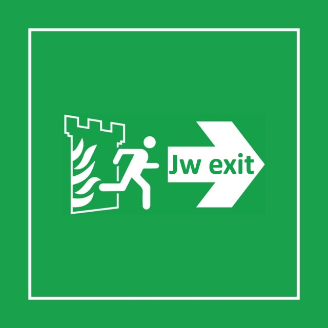

# Ex Jw Resources and Help

List of resources to help ex-JW (Jehovah's Witnesses) 

Select your language:
- [English](#english)
- [Italiano](#italiano)

     
*Image credits: [UK Podcasts](https://uk-podcasts.co.uk/podcast/jexit-2020/exjw-interview-david-lyndon-moult)*

## Table of Contents

- [English](#english)
  - [Books](#books)
  - [Communities En](#communities-en)
  - [Psycology support](#psycology-support)
      - [Videos](#videos)
  - [Websites](#websites)
- [Italiano](#italiano)
  - [Articoli](#articoli)
  - [Communities](#communities-it)

# English

## Books
- [Leaving the Fold: A Guide for Former Fundamentalists and Others Leaving Their Religion](https://www.amazon.it/dp/1933993235/)

## Communities En
- [Instagram - apostatebarbie](https://www.instagram.com/apostatebarbie/)
- [Reddit - r/exjw](https://www.reddit.com/r/exjw/)
- [Reddit - r/exjw Wiki of resources](https://www.reddit.com/r/exjw/wiki/index/)
- [Reddit - r/exjwLGBT](https://www.reddit.com/r/exjwLGBT/)
- [Reddit - r/exjwhumor/](https://www.reddit.com/r/exjwhumor/)
- [Reddit - r/exjwselfies/](https://www.reddit.com/r/exjwselfies/)
- [Threads - @apostatebarbie](https://www.threads.net/@apostatebarbie)
- [TikTok - @apostatebarbie](https://www.tiktok.com/@apostatebarbie)
- [X.com - apostatebarbie](https://x.com/apostatebarbie)
- [X.com - ExJWCaleb](https://x.com/ExJWCaleb)
- [X.com - KT - (ExJW Supporting Attorney in JPN)](https://x.com/tanakaattorney)
- [Youtube - Brighter Lights](https://www.youtube.com/@Brighter_Lights)
- [Youtube - ExJW Critical Thinker](https://www.youtube.com/channel/UCpHhWSPtMDTSa8dzapmzo5A)
- [Youtube - EXJW Diaries](https://www.youtube.com/@exjwdiaries)
- [Youtube - ExJW Panda Tower](https://www.youtube.com/channel/UCDLalBD_PsUrj4ZEeWW7Tig)
- [Youtube - Lloyd Evans](https://www.youtube.com/channel/UCz1w0ll081JJiYcjb298pOw)
- [Youtube - Self Aware NPC](https://archive.org/details/self-aware-npc/)
- [Youtube - The Truth Hurts](https://www.youtube.com/c/TheTruthHurts)

## Psycology support
- [JW.Support - Assist youths being raised as Jehovah’s Witnesses, who have come to realize Watchtower is not "the truth"](https://jw.support/)
- [PCC Methodology - Post Cult Counseling ](https://www.willowtreepsychology.com.au/Post-Cult-Counselling)

### Videos

- [Stories of Hope and Recovery: Jordan's Story](https://www.youtube.com/watch?v=4EtpEmFDL3Y&list=PLBXgZMI_zqfR4dvBdX7XHD-fjgoehFM_9&index=4)
- [Stories of Hope and Recovery: Terry Wise](https://www.youtube.com/watch?v=nbTsOAy2M0Q&index=1&list=PLBXgZMI_zqfR4dvBdX7XHD-fjgoehFM_9)
- [Stories of Hope and Recovery: David's Story](https://www.youtube.com/watch?v=mVXLj0bNe0o&index=3&list=PLBXgZMI_zqfR4dvBdX7XHD-fjgoehFM_9)

## Websites
- [AAWA - ADVOCATES for AWARENESS of WATCHTOWER ABUSES](https://www.aawa.co/)
- [JWfacts.com](https://jwfacts.com/)
- [JWS Online Library - All WT publications since 1880](https://jws-library.one/)
- [JW Watch - This website has been launched to give voice to millions of Jehovah’s Witnesses around the world who would not normally have the opportunity to say what they really think about the Watch Tower Society](https://jwwatch.org/)
- [Recovering From Religion - Offers peer support and professional support to people doubting their beliefs](https://www.recoveringfromreligion.org/#rfr-welcome)

# Italiano

## Articoli
- [Come lasciare la religione dei Testimoni di Geova senza essere ostracizzati (tradotto dal sub in inglese)](https://www.reddit.com/r/extg/comments/1dno5w8/come_lasciare_la_religione_dei_testimoni_di_geova/)
- [Critiche ai Testimoni di Geova - Wikipedia](https://it.wikipedia.org/wiki/Critiche_ai_Testimoni_di_Geova)
- [I Testimoni di Geova possiedono la Verità? - Doc da JWfacts.com](https://www.jwfacts.com/print/jw-studies-pamphlet-italian.pdf)

## Communities It
- [Facebook - L'Apostataccio](facebook.com/windofchange88)
- [Instagram - windofchange.sf](instagram.com/windofchange.sf/)
- [Reddit - r/extg](https://www.reddit.com/r/extg/)
- [Telegram - Apostagram canale](https://t.me/%20V6oRGqcFDyMyMmU8)
- [TikTok - Apostataccio](tiktok.com/@apostataccio)
- [Youtube Apostataccio](https://www.youtube.com/@apostataccio)
